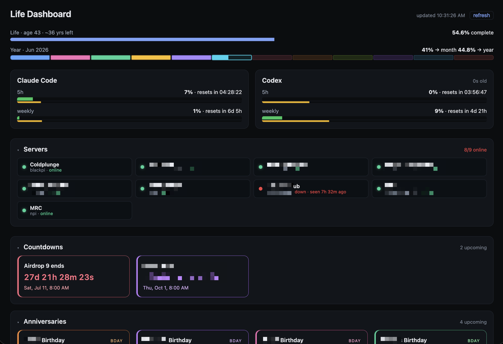

# Life Dashboard

A self-hosted personal dashboard. At a glance it shows:

- **Life & year progress** — what fraction of your life expectancy you've lived
  (age, years remaining) plus a 12-month strip for the current year, color-coded
  by month, with the live month filling in real time.
- **AI usage limits** — live Claude Code and Codex rate-limit gauges for every
  window the account currently exposes, with reset countdowns.
- **Analytics** — grouped bar charts of recent daily metrics per location (e.g.
  batches/photos generated and prints requested/completed), driven entirely by
  numbers you keep in config.
- **Checklists** — recurring daily/weekly/specific-weekday tasks, grouped into
  labeled sections, with a day-by-day navigator so you can review what you got
  done or missed on any date.
- **Oura Ring** — last night's sleep summary plus today's step count, fetched
  from Oura's V2 API.
- **Live log** — a business "what happened overnight" panel: stat tiles plus a
  merged, reverse-chronological activity feed (e.g. signups, newsletter opt-ins,
  purchases, trial starts and conversions) pulled from any JSON HTTP endpoints
  you configure, with optional wallet-signature login.
- **Servers** — online/offline status of your Tailscale machines.
- **Countdowns & Anniversaries** — upcoming calendar events and recurring
  birthdays/anniversaries, split into two panels (Countdowns ordered
  soonest-first; Anniversaries ordered by upcoming year milestone).

Most settings read from `config.local.json`; OAuth integrations also use local
environment variables and `.cache/` token files. Sections you don't configure are
simply omitted.



## Requirements
- Node 22+ (24 recommended)
- macOS or Linux (paths assume `~/.claude` and `~/.codex`)
- Both Claude Code and Codex must have been run at least once on this machine
  (for the usage gauges)
- The Tailscale CLI on this host, and this host joined to your tailnet, for the
  Servers panel (optional — leave `tailscaleHosts` empty to hide it)
- An Oura developer app with the `daily` scope, for the Oura panel (optional)

## Setup
```bash
npm install
cp config.example.json config.local.json
# Edit config.local.json — see "Configuration" below.
npm run dev
# Open http://127.0.0.1:3000
```

To run on a different port, set `PORT`:
```bash
PORT=3100 npm run dev
```

For production, build once and serve:
```bash
npm run build
npm start            # next start -H 127.0.0.1 (honors PORT)
```

## Configuration

Dashboard settings live in `config.local.json` (gitignored). `config.example.json`
is a complete, working template. OAuth credentials use local environment
variables. Every key is optional; omit a section to hide its panel.

```json
{
  "icsUrl": null,
  "manualEvents": [
    { "title": "Flight to Tokyo", "start": "2026-06-15T08:00:00Z", "pinned": true },
    { "title": "Product launch",  "start": "2026-07-01T17:00:00-05:00" },
    { "title": "Tax deadline",    "start": "2027-04-15" }
  ],
  "birthdays": [
    { "name": "Ada",   "month": 12, "day": 10, "year": 1815 },
    { "name": "Grace", "month": 12, "day": 9 },
    { "name": "Ada & Charles", "type": "anniversary", "label": "Wedding", "month": 7, "day": 8, "year": 1835 }
  ],
  "pinnedEvents": ["Flight"],
  "refreshSeconds": 60,
  "life": { "birthDate": "1990-01-15", "expectancyYears": 80 },
  "tailscaleHosts": [
    { "host": "blackpi", "alias": "Cold plunge" },
    { "host": "winton.tail87750.ts.net", "alias": "Office box" },
    { "host": "100.126.38.102", "alias": "By IP" }
  ],
  "checklists": {
    "title": "Daily Checklists",
    "weekStart": "mon",
    "groups": ["Morning", "Nightly", "Weekly"],
    "items": [
      { "group": "Morning", "label": "Cold plunge" },
      { "group": "Morning", "label": "Supplements" },
      { "group": "Nightly", "label": "Supplements" },
      { "group": "Weekly",  "label": "Long run",  "repeat": "weekly" },
      { "group": "Weekly",  "label": "Meal prep", "repeat": ["sun"] }
    ]
  }
}
```

### Events (Countdowns & Anniversaries)

Events come from two sources, merged together (duplicates removed, pinned events
bubble to the top):

- **`manualEvents`** — a JSON array you maintain by hand. `start` accepts any
  string `Date.parse` understands: ISO 8601 (`"2026-06-15T08:00:00Z"`), a
  date-only string (`"2026-09-12"`, treated as midnight UTC), or a verbose form
  like `"Jul 1 2026 17:00:00 GMT+0800"`. `pinned: true` sorts an event to the top.
  Past events are dropped automatically.
- **`icsUrl`** — a private `.ics` URL (e.g. Google Calendar's "Secret address in
  iCal format"). Set to `null` to disable. Note: Google Workspace organizational
  calendars only expose a *public* iCal URL, not a secret one — manual entries are
  usually the right answer for work-managed accounts. Can also be supplied via the
  `ICS_URL` environment variable, which overrides the file value.

**`pinnedEvents`** is a list of keywords; any event (from either source) whose
title contains one of them (case-insensitive substring) is pinned.

Events are split into two panels on the dashboard:

- **Countdowns** — everything else. Ordered soonest-ending first.
- **Anniversaries** — `birthdays`/anniversaries (see below) and any event whose
  title contains "birthday" or "anniversary". Ordered by upcoming year milestone
  (turning 4, turning 44, …), smallest first; entries without an origin `year`
  have no milestone and fall to the end by calendar date.

Pinned events are kept on top in both panels, and both are collapsible.

### Birthdays & anniversaries

**`birthdays`** are recurring annual events, rendered in the Anniversaries panel:

- `name`, `month` (1–12), `day` (1–31) are required. Each entry automatically
  rolls to its next occurrence, so it's always a countdown to the next one.
- `type` is `"birthday"` (default) or `"anniversary"`. Birthdays title as
  *"<name>'s Birthday"* and show a `BDAY` badge; anniversaries title as the
  `name` and show an `ANNIV` badge — so not everything is assumed to be a birthday.
- `label` (optional) overrides the title outright, e.g. `"Wedding"`.
- `year` (optional) is the origin year — birth year, wedding year, etc. When
  present the card shows the upcoming count of years elapsed (the age, for a
  birthday); when omitted it shows just the countdown and date.

### Life progress

**`life`** powers the progress bars at the top:

- `birthDate` — ISO date (`"1990-01-15"`).
- `expectancyYears` — used to compute the "% of life complete" bar (age and
  estimated years remaining).
- The year strip below it is purely calendar-driven (month + year percentages),
  independent of `life`.

Omit `life` to hide the top bars.

### Checklists

**`checklists`** powers the Checklists panel — recurring tasks you tick off each
day, with a `‹ / ›` navigator to move one day at a time through history.

```json
"checklists": {
  "title": "Daily Checklists",
  "weekStart": "mon",
  "groups": ["Morning", "Lunch", "Dinner", "Nightly", "Weekly"],
  "items": [
    { "group": "Morning", "label": "Cold plunge" },
    { "group": "Morning", "label": "Olive oil" },
    { "group": "Lunch",   "label": "Olive oil" },
    { "group": "Weekly",  "label": "Long run",  "repeat": "weekly" },
    { "group": "Weekly",  "label": "Meal prep", "repeat": ["sun"] },
    { "group": "Weekly",  "label": "Trash out", "repeat": ["mon", "thu"] }
  ]
}
```

- `title` — panel heading (defaults to `"Checklists"`).
- `weekStart` — the weekday a week rolls over on, for weekly items (`"mon"`
  default … `"sun"`; 3-letter or full names).
- `groups` (optional) — fixes the display order of the labeled sections. Groups
  used by items but not listed here are appended in first-seen order; items with
  no `group` render last without a header.
- `items` — each needs a `label`. Optional `group`, optional `repeat`, and an
  optional explicit `id`.
- `repeat` controls cadence (defaults to `"daily"`):
  - `"daily"` — appears every day.
  - `"weekly"` — appears every day until you check it once; that completes the
    whole week (it stays checked through the configured week boundary).
  - `["mon", "wed", "fri"]` — appears only on those weekdays (3-letter or full
    names, case-insensitive).

Each item gets a stable id derived from its group + label, so the same label in
different groups (e.g. "Olive oil" under Morning/Lunch/Dinner) is tracked
separately. Set an explicit `id` if you want history to survive a label rename.

Check-off state is stored on the server in `.cache/checklist-state.json` (so it's
shared across every device that opens the dashboard), keyed by date — daily and
specific-weekday items by day, weekly items by week. "Today" is your browser's
local day, so the right day is recorded regardless of the server's timezone. Past
and future days are both navigable and editable; the **Today** button jumps back
to the present. Omit `checklists` to hide the panel.

### Oura Ring

The Oura panel shows the selected day's main sleep period and daily activity
steps, with a day-by-day navigator for reviewing recent history. When authorized
with the `heartrate` scope, the panel footer estimates the last ring sync from
the latest heart-rate sample available through Oura; otherwise it falls back to
the dashboard check time. It uses Oura API V2 OAuth and stores the rotating user
token locally in `.cache/oura-token.json`.

Add these to `.env.local`:

```bash
OURA_CLIENT_ID=your-oura-client-id
OURA_CLIENT_SECRET=your-oura-client-secret
# Optional; defaults to http://127.0.0.1:3000/api/oura/callback
OURA_REDIRECT_URI=http://127.0.0.1:3000/api/oura/callback
# Optional; defaults to the server's timezone
OURA_TIME_ZONE=Asia/Singapore
```

In the Oura developer portal, the redirect URI must exactly match
`OURA_REDIRECT_URI`. Then start the dashboard and open:

```text
http://127.0.0.1:3000/api/oura/connect
```

If your Oura app already uses an external redirect URI, keep that value in
`OURA_REDIRECT_URI`, run the authorization flow there, then exchange the returned
`code` locally at:

```text
http://127.0.0.1:3000/api/oura/exchange
```

The panel is omitted when `OURA_CLIENT_ID` is not set. If credentials are present
but no user token has been stored yet, the panel shows a connect link. Tokens
created before the `heartrate` scope was requested must be reconnected before
the sync estimate can be shown.

### Servers (Tailscale)

**`tailscaleHosts`** lists machines to monitor. Each is `{ "host": ..., "alias"?: ... }`
where `host` is a bare hostname (`"blackpi"`), an FQDN
(`"winton.tail87750.ts.net"`), or a Tailscale IP (`"100.126.38.102"`); `alias` is
the display name and falls back to `host`.

Status is read from `tailscale status --json`, which reflects the **control
plane's** view of each peer — so it works even when this host can't directly
route to the machine. The Servers panel collapses automatically when everything
is online and auto-expands the moment a server goes down.

### Analytics (charts)

**`analytics`** powers the charts panel, including a week-by-week navigator for
live sources. It's fully config-driven — the dashboard renders whatever daily
datapoints you put here, so the grouping and labels are yours to define:

```json
"analytics": {
  "title": "Analytics",
  "days": ["Mon", "Tue", "Wed", "Thu", "Fri", "Sat", "Sun"],
  "locations": [
    {
      "name": "Site A",
      "url": "https://site-a.example.com/admin/analytics",
      "charts": [
        { "title": "Generation", "series": [
          { "label": "Batches", "values": [40, 52, 38, 61, 75, 58, 49] },
          { "label": "Photos",  "values": [320, 410, 300, 520, 640, 470, 390] }
        ]},
        { "title": "Prints", "series": [
          { "label": "Requested", "values": [18, 24, 15, 29, 33, 21, 19] },
          { "label": "Completed", "values": [17, 22, 15, 27, 31, 20, 18] }
        ]}
      ]
    }
  ]
}
```

- `title` — panel heading (defaults to `"Analytics"`).
- `days` — x-axis labels, one per data point (e.g. the last 7 days).
- `locationLayout` (optional) — set to `"grid"` to place locations in responsive
  columns; omit it or use `"stack"` for the default top-to-bottom location list.
- `locations` — each is `{ name, url?, chartLayout?, syncHover?, source?, charts }`.
  `url` (optional) adds a "source" link. By default, each location renders its
  charts side by side with independent hover state.
- `chartLayout` (optional) — set to `"vertical"` to stack a location's charts;
  omit it or use `"grid"` for the default side-by-side layout.
- `syncHover` (optional) — set to `true` to share the hovered day across all
  charts in that location. This is useful for related charts with the same
  x-axis, regardless of whether they are side by side or stacked.
- `charts` — each is `{ title, series }`. Every chart draws its series as lines
  across the days, with a per-series total in the legend. Two series per chart
  (a natural pair) reads best, but any number works.

For two tracked locations where each has two related charts, use
`"locationLayout": "grid"` on `analytics` plus `"chartLayout": "vertical"` on
each location. That renders one location per column, with its charts stacked.

Each **series** is one of two modes:

- **Static** — `{ label, values }`, where `values` is one number per `day`. Good
  for hand-maintained snapshots; this is what `config.example.json` ships.
- **Live** — `{ label, field }`, used together with a location-level `source`. The
  dashboard fetches the data on each refresh and reads `field` from each daily row.

To pull live data, add a `source` to the location and switch its series to `field`:

```json
{
  "name": "Site A",
  "url": "https://site-a.example.com/admin/analytics",
  "source": {
    "api": "https://api.example.com/analytics/historical",
    "origin": "https://site-a.example.com",
    "params": { "days": 7 }
  },
  "charts": [
    { "title": "Generation", "series": [
      { "label": "Batches", "field": "batches" },
      { "label": "Photos",  "field": "photos" }
    ]},
    { "title": "Prints", "series": [
      { "label": "Requested", "field": "requested" },
      { "label": "Completed", "field": "completed" }
    ]}
  ]
}
```

The `source` describes any JSON HTTP endpoint that returns one row per day
(either a top-level array or `{ "data": [ … ] }`):

- `source.api` (required) — the endpoint URL.
- `source.origin` (optional) — sent as the request's `Origin`/`Referer` header.
  Use it for APIs that return different data per calling origin.
- `source.params` (optional) — query params appended to the URL, e.g.
  `{ "days": 7 }`.
- `source.rangeParams` (optional) — override the query parameter names used for
  the selected 7-day range when your API supports explicit ranges, e.g.
  `{ "start": "from", "end": "to", "offset": "week" }`.
- `source.dateField` (optional) — the row property holding the day; defaults to
  `"date"`.
- Series then use `field` (the row property to read each day) instead of
  `values`; the day labels come from each row's date field. By default, the
  dashboard increases the `days` lookback as you move back by week, then slices
  the selected 7-day window locally. If `rangeParams` is configured, it sends the
  selected UTC start, end, and week offset using those parameter names instead.
  Results are cached briefly server-side per selected week. If a location's fetch
  fails, that location shows an "Unavailable" message while the others keep
  rendering.

Malformed entries are dropped defensively, and non-numeric values become `0`.
Omit `analytics` entirely to hide the panel.

### Live log (activity feed)

**`liveLog`** renders a morning-review panel: a row of stat tiles plus a single
reverse-chronological feed merged from any number of JSON HTTP sources (think
signups, purchases, subscription starts). Like `analytics`, it is fully
config-driven — the committed code knows nothing about any particular vendor;
your endpoints, field mappings, and credentials live only in the gitignored
`config.local.json` / `.env.local`. See `config.example.json` for a complete
sample block.

Top-level: `title`, `windowHours` (feed lookback, default 48), `maxItems`
(merged cap, default 60), optional `auth`, `stats`, and `sources`.

**Stats** — each group is `{ api, params?, items }`; every item reads one number
from the group's JSON response via `path` and renders a tile. Paths are dotted
and may select from arrays: `"data.byPeriod[period=monthly].count"`. `format`
is `"number"` (default), `"usd"`, or `"percent"` (values ≤ 1 are treated as
fractions).

**Sources** — each is one feed: `{ id, label, color?, api, params?, dates?,
itemsPath, time, title?, detail?, value?, badges?, variants?, require?,
exclude?, enrich?, windowHours?, limit? }`.

- `itemsPath` — dotted path to the response's row array (envelope-agnostic).
- `time` — row field holding the timestamp; unix seconds, milliseconds, and ISO
  strings are auto-detected. Rows outside the window are dropped.
- `title` / `detail` / `value` — `"{field}"` templates (dotted paths allowed);
  parts separated by `" · "` collapse cleanly when a field is missing. `value`
  renders right-aligned (e.g. `"${amountUsd} · {credits} credits"`).
- `badges` — chips per row: `{ field, map?, color? }`. With `map`, only mapped
  values render (e.g. `{ "monthly": "Monthly", "annual": "Annual" }`); without
  it the raw value is shown.
- `require` / `exclude` — **row gates, applied before anything renders.**
  `require` keeps only rows where every condition holds; `exclude` drops rows
  matching any. Treat these as the local backstop for server-side query
  filters: if an API ignores or defaults a `status` param, unwanted rows still
  never reach the feed. Gates run before `limit`, so junk can't crowd out real
  rows.
- `variants` — reclassify rows: the first variant whose conditions ALL match
  overrides the row's label/color. Use an array to require several conditions
  at once (e.g. `status` in `[active, grace]` **and** `trialEnd` present →
  "Converted"), which keeps a churned row from matching a "converted" rule.
- `enrich` — resolve extra fields per row from a second endpoint:
  `{ api, key, fields, ttlHours?, max? }`. `api` may contain `${value}` (the
  `key` field's value); `fields` maps a row field name to a response path.
  Results are cached per key (default 24h), deduped within a refresh, and
  capped at `max` lookups (default 25). A failed lookup leaves the field absent
  and is reported — the row still renders.
- `dates` — fan out one request per entry, substituting `${date}` into `params`
  (for day-bucketed endpoints: `["${today}", "${yesterday}"]`).

**Conditions** (used by `require`, `exclude`, and `variants.when`) are
`{ field, equals? , in?, nonNull? }`. Values compare as strings, `in` accepts a
list, and `nonNull` treats `null`/missing/empty-string as absent.

Param values and `dates` accept UTC time tokens: `${today}`, `${yesterday}`,
`${ymdDaysAgo:N}`, `${isoDaysAgo:N}`, `${epochDaysAgo:N}`, `${nowIso}`.

**Auth** (optional) — `"type": "walletSign"` performs a wallet-signature login
(the flow used by web3-style admin APIs): fetch a nonce from `nonceUrl`, sign
it, POST to `loginUrl`, read a bearer token at `tokenPath` (default
`"data.token"`). The signing key comes from one of:

- `privateKeyEnv` — env var *name* holding a raw 32-byte hex key, or
- `derive` — `{ usernameEnv, passwordEnv, salt, iterations?,
  lowercaseUsername? }`: the key is PBKDF2-SHA256-derived from
  username+password (the "credentials wallet" pattern), so `.env.local` holds
  ordinary credentials instead of an exported key.

`walletAddress` is optional — when omitted it is computed (EIP-55 checksummed)
from the key. The signature is EIP-191 `personal_sign` by default; set
`signature` to `{ "scheme": "eip712", domain, primaryType, types, message }`
for APIs that verify EIP-712 typed data (field types `address` / `string` /
`uint256`; `message` values may use `${nonce}` and `${walletAddress}`). Both
schemes are test-locked against ethers v6 vectors. The token is cached in
`.cache/livelog-session.json` (`0600`), auto-renewed before expiry, and
re-obtained once on a 401/403. `origin` is sent as `Origin`/`Referer` for APIs
that allowlist calling origins; `extraBody` is merged into the login POST. Omit
`auth` entirely for public endpoints.

Rows render as `HH:MM · source · title · badges · detail · value`, grouped
under Today / Yesterday / date separators in your local timezone (hover a
timestamp for its relative age).

Failure handling matches the other panels: each source/stat group fails
independently (amber inline notice), successful fetches are cached server-side
for 60s, and the last healthy payload is kept in
`.cache/livelog-last-good.json` so an API outage shows stale data (dimmed, with
a "stale" footer) instead of a blank panel. Omit `liveLog` entirely to hide the
panel.

A note on trusting the feed: anything money-related is worth pinning down with
`require` so a permissive API default can't turn a failed or abandoned payment
into what looks like a sale. Keeping negative events (refunds, cancellations)
in their own source with a distinct label and color — rather than filtering
them away — means you see them without ever mistaking them for revenue.

### Refresh

**`refreshSeconds`** controls the dashboard's polling interval (default 60,
minimum 5).

## How the data is fetched
- **Codex limits** are fetched live by spawning `codex app-server` and calling its
  `account/rateLimits/read` JSON-RPC method — the same call the Codex TUI makes
  for `/status`. (Older versions persisted a `codex.rate_limits` row to
  `~/.codex/logs_2.sqlite`, but Codex >= 0.135 stopped writing it.) Requires the
  `codex` binary on PATH; Codex can expose one or two windows, and the dashboard
  renders every usable one. If the call fails, the panel shows the error.
- **Claude limits** are fetched from Anthropic's OAuth usage endpoint. Credential
  candidates come from the dashboard's private cache, the macOS login Keychain
  (service `Claude Code-credentials`, which Claude Code keeps current), and
  `~/.claude/.credentials.json`; whichever is freshest wins. The token never reaches
  the browser, and is auto-refreshed when expired using Claude Code's
  JSON OAuth refresh format (backing off on `Retry-After` when rate limited). A newer
  valid credential written by Claude Code immediately invalidates a cached auth
  failure. Rejected access tokens trigger one immediate credential reload/refresh and
  usage retry; repeated refresh rate limits progressively back off from 15 minutes to
  four hours. Concurrent dashboard requests share one refresh, and a rotated token is
  saved with `0600` permissions in the gitignored `.cache/claude-oauth.json` so recovery
  survives dashboard restarts. Recent fetch failures are logged per source in a
  collapsible list under each gauge.
- **Live log** events come from whatever JSON HTTP endpoints `liveLog` names in
  `config.local.json`, fetched server-side in parallel with a 10s timeout, cached
  per source for 60s, and merged into one feed. Auth (when configured) is a
  wallet-signature login whose bearer token stays server-side in
  `.cache/livelog-session.json`; the signing key never leaves `.env.local`.
- **Servers** come from the local `tailscale` CLI (see above), cached briefly.
- **Oura Ring** comes from Oura API V2: `daily_sleep` and `sleep` for last
  night's sleep, `daily_activity` for today's steps, and `heartrate` for an
  approximate last-sync indicator when authorized. OAuth access tokens are
  refreshed server-side and the rotated token is kept in `.cache/oura-token.json`.
- **Events** come from `manualEvents`, `birthdays`, and/or `icsUrl`, all merged.

## Security
The server binds to `127.0.0.1` only. `config.local.json`, `.env*.local`, and
`.cache/` are gitignored because they can contain private calendar URLs, OAuth
client secrets, user tokens, private admin API endpoints, and the live log's
signing key or credentials. OAuth/bearer tokens never leave the server. If you
configure `liveLog` auth, prefer a dedicated account/key that holds no funds.

## Tests
```bash
npm test          # vitest run
npm run typecheck # tsc --noEmit
```
